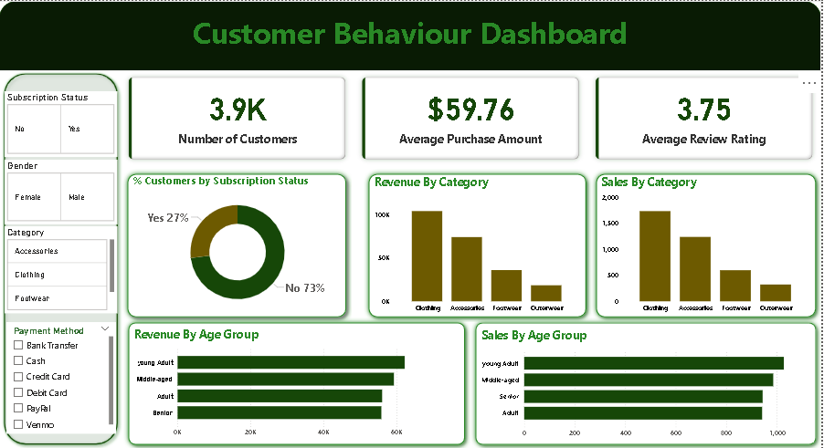

# Customer-Behaviour-Analysis
Uncovering what drives purchasing decisions across 3,900 retail transactions.

## Tools Used
- Python
- SQL
- Power BI

## Project Overview
 project focused on understanding customer behavior using Python, SQL, and data visualization tools. This analysis uncovers trends, purchasing patterns, and customer insights to support data-driven decision-making and improve business strategy.

## Business Impact
The insights from this analysis directly support decisions around:

-  Targeted marketing and personalised promotions
-  Inventory planning and category investment
-  Subscription programme optimisation
-  Customer retention and churn reduction strategies

## Preview

> Click the image above too see a preview of the final dashboard.
# Customer-Behaviour-Analysis
This repo contains a Full end-end analysis project done in Python, SQL and Power BI
